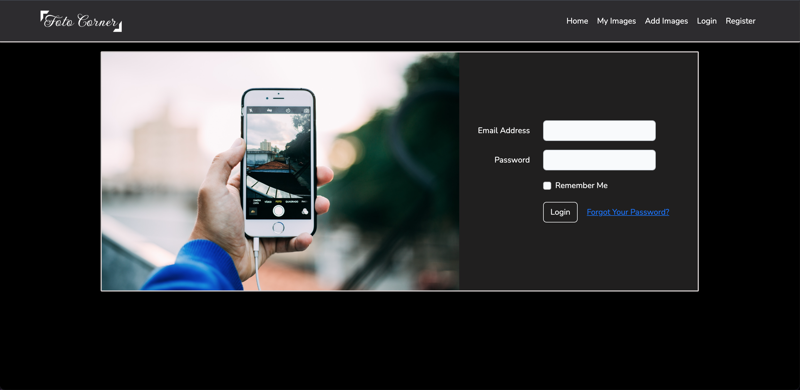

<body style="background : black;">

# 📷 About Foto Corner 

Foto Corner is a simple application for **Factoria F5** to manage favorite photos using Laravel framework following CRUD functions through MVC structure

## ⚙️ Installation

* Clone the repository [git clone https://github.com/amrhefny87/foto-corner.git]
* Create a database using phpMyAdmin
* Copy .env.example and rename it .env, Fill the file with the database information
* [composer update]
* [php artisan migrate:fresh --seed]
* [npm install & npm run dev]

 

## 🧪 Testing the application
* [php artisan test] or [.vendor/bin/phpunit]

 

## 🏃‍♀️ Running the application
* [php artisan serve]

 

## Let's get started 🚀🚀🚀

 

_The **Landing page**, you will be needing to register or login in order to use the features of the application, you will find the options to register or login in the navbar_

_After registering or login, you will be redirected automatically to either the **Landing page** or **My Images** page_

* _A list of your added images will be viewed if you have already added images order by the newest_
* _To view the image in larger scale; you can click directly on the photo or hover above the lower part of the images and three icons will appear, use the opening door icon_
* _To edit the name or the url of an image; use the hovering pencil icon_
* _To delete an image; use the hovering bin icob_
* _To Add and image; use **Add Image** in the navbar_

 

## 🔧 Tools and langauges used
* Visual Studio Code
* Figma
* Trello
* Php 8.1.10
* Laravel Framwork 9.30.1
* Bootstrap 5.2.1
* Bootstap Icons
* MAMP
* MySQL
* Pixaby.com [a website for free images download]
* Lightbox js [a Javascript library to open images beautifully]

 

## 🧱 Architecture & Techniques
* Clean Code
* TDD
* MVC
* Responsive

 

## 🔗 Author
- **[Amr Hefny](https://www.linkedin.com/in/amrhefny/)** [LinkedIn page is Linked]

</body>
